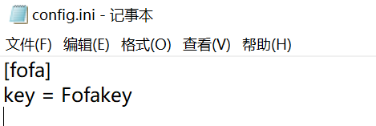
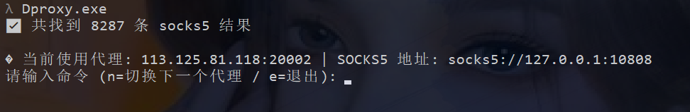
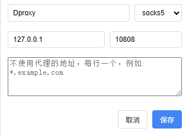

# Dproxy

Socks5代理采集与使用

此工具在于**授权**渗透测试过程中，因**IP封禁**导致无法继续测试目标而研究。

## 严正声明

**本项目所有内容仅作为安全研究和授权测试使用, 相关人员对因误用和滥用该项目造成的一切损害概不负责**

## 使用方法

#### 1、数据来源

目前数据来源为Fofa，需要在config.ini文件中配置key

#### 2、运行结果

1.在终端命令行中直接使用即可

2.通过输入n进行切换代理，输入e进行退出

3.在代理工具中配置socks5代理，即可使用

## 项目地址

https://github.com/G-pledge/Dproxy/

## 更新记录
20250706  增加fofa查询语句，以增加可用代理数量
